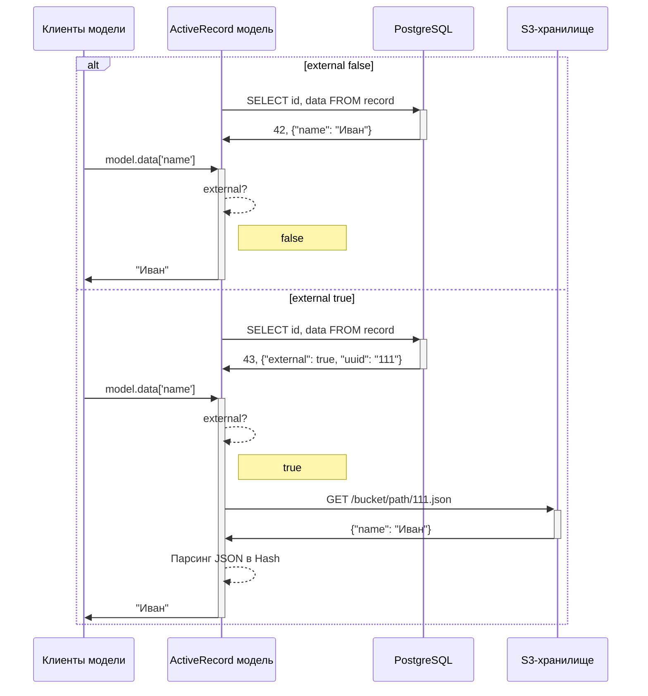

# ExternalHash: когда большие JSONB лучше хранить не в БД

## 1. Кейсы, которые приводят к необходимости использования этого подхода

В Rails-приложениях тип JSONB — настоящая находка. Он гибкий, не требует строгой схемы и идеально подходит для хранения сложных структур данных «как есть». В нём можно сохранить ответ внешнего API, состояние объекта в архиве или даже промежуточные результаты вычислений — и всё это в одном поле.
Но у этого удобства есть обратная сторона — «жирные» JSONB могут буквально раздувать базу данных и убивать производительность.

Когда начинаются проблемы
1. Рост объёма хранилища.
Один крупный JSONB может занимать десятки или даже сотни килобайт. Если таких записей миллионы, размер базы растёт лавинообразно.
2. Дорогие бэкапы и восстановление.
Резервные копии становятся огромными, а при восстановлении тратится время на загрузку того, что почти никогда не используется.
3. Сложность анализа.
PostgreSQL умеет искать по JSONB, но индексация больших структур дорогая, а полное сканирование — ещё дороже.
4. Память и скорость в Rails.
При инициализации ActiveRecord-модели Rails десериализует JSONB в Ruby Hash.
В памяти Hash может занимать в несколько раз больше исходного JSON. На больших массивах это приводит к замедлению и лишней нагрузке на GC.
5. Редкое использование тяжёлых данных.
Классический пример — архивные состояния сущности. Они нужны редко, но всё равно хранятся рядом с «активными» данными и подгружаются в память при каждом запросе.

Наш реальный кейс
В одном из проектов мы получаем от внешнего api данные в формате JSON. Сначала это были небольшие ответы — несколько килобайт, и проблем не было. Но в какой-то момент мы получили JSON размером 20 мегабайт. И внезапно обнаружили, что:
- из базы он грузится очень долго;
- в памяти Ruby такой JSON распаковывается в Hash весом около 200 мегабайт (!).

Это стало отправной точкой. Мы поняли, что дальше так работать нельзя, и пересмотрели архитектуру хранения больших JSON. Сейчас мы спокойно принимаем JSON до 50 Мб — и приложение не испытывает проблем ни с загрузкой, ни с памятью.


## 2. Идея ExternalHash
Первое очевидное решение — это хранить JSON как файлы в файловой системе и подгружать их по мере необходимости. При этом хочется:
- сохранить существующий интерфейс;
- оставить возможность старого хранения для некоторых кейсов;

Как мы это сделали. ActiveRecord позволяет регистрировать собственные типы. Т.е. мы можем создать, который выглядит для приложения как обычный Hash, а при обращении к полям хеша лениво загружать в память JSON и парсить его в хеш, после чего отдавать запрошенные значения. Такой подход мы назвали ExternalHash.
Сам JSON храним в S3 хранилище из-за очевидных преимуществ:
- масштабируемость: объектные хранилища позволяют хранить сотни гигабайт или терабайты данных без сложных настроек;
- доступ с нескольких серверов: в продакшене у нас несколько инстансов приложения, и у каждого должен быть доступ к данным;
- надёжность: объектные хранилища обычно имеют встроенную репликацию и контроль целостности;
- гибкость: для передачи таких JSON между различными сервисами достаточно передать ссылку на файл и не генерить ненужный трафик.

В итоге мы сохранили весь существующий код, и теперь можем без проблем хранить большие JSON без лишней нагрузки на БД. А в сочетании с SAX парсером смогли оптимизировать потребление памяти при обращении к полям JSON, т.к. SAX-парсер выполняет последовательную обработку файла и выдает только запрошенные значения вместо загрузки в DOM-структуру всего файла.

## 3. Реализация в Rails
Расскажу немного про реализацию. Давайте вспомним ключевые требования:
- совместимость интерфейсов;
- ленивая загрузка;
- поддержка обоих вариантов.

Посмотрим на схему в соответствии с которой должно все работать. Пусть у нашего объекта объекта будет поле data, которе должно реализовывать задуманную логику.



Как же 

```ruby
class MaybeExternalHash < ActiveSupport::Hash
  
  # Класс-обертка над скаченным файлом
  class ExternalHash

    # При инициализации получает ссылку на объект временного файла
    def initialize(file)
      @file = file
    end

    # Если уверены, что JSON небольшой просто парсим в обычный хеш
    def to_hash
      @hash ||= JSON.load(@file)
    end

    # Но если JSON большой лучше использовать SAX-парсер
    def query(path, &)
      Parser.parse(@file, path)
    end
  end

  # Метод для скачивания файла, который возвращает не сам обернутый файл
  def download
    return unless external?
    file = Loader.get(external_uuid)
    ExternalHash.new(file[:file])
  end

  def [](key)
    if external?
      get_data_from_external(key.to_s)
    else
      super
    end
  end

  # Так мы делаем ленивую загрузку файла т.е. только в момент обращения к данным и сразу его кешируем, чтобы не загружать файл при каждом обращении
  def get_data_from_external(path)
    return nil unless external?
    @hash ||= self.download
    value = @hash&.query(path)
    value[0][1]
  end


  # Вот интересный метод. Как нам понять что это ExternalHash или обычный. Ранее я говорил, что для описания ExternalHash нам потребуется ссылка на файл и признак того, что это external, но как обратиться к этим значениям если с учетом идеи сохранения интерфейса когда мы попытаемся обратиться к какому-нибудь ключу атрибута типа MaybeExternalHash мы должны предоставить доступ к ключу во внешнем JSON файле, а не к ключу в JSON лежащем в БД и хранящем само значение ссылки на файл или признака external. Для этого нам нужно получить доступ к JSON лежащему в БД, т.е. хакнуть свой же механизм сохранения интерфейса. Для этого мы не к своему переопредленному методу, а к методу родительского класса, но поскольку этот метод не статический, нужно чтобы метод выполнялся в контексте текущего объекта для этого делаем bind(self). И таким образом мы можем достучаться до JSON, который лежит в БД и в котором есть описание ExternalHash.
  def external?
    self.class.superclass.instance_method(:[]).bind(self).call(:external)
  end

  # Схожим образом мы достаем саму ссылку на external
  def external_uuid
  end

  
  
  # Получается что мы описали тип, теперь его нужно зарегистрировать и присвоить атрибуту модели. Но для этого требуется описать способ его сериализации и десериализации. 
  class Type < ActiveRecord::Type::Json

    def cast(raw_value)
      value = super
      MaybeExternalHash.new(value)
    end

    def deserialize(raw_value)
      value = super
      MaybeExternalHash.new(value)
    end

  end

end
```

4. Плюсы и минусы

Плюсы:
- существенное уменьшение размера базы — особенно заметно, если JSONB поля большие;
- скорость выборок — в большинстве запросов мы не десериализуем и не тянем тяжёлый JSON;

Минусы:
- дополнительный сетевой запрос к внешнему хранилищу при первом обращении;
- медленное извлечение данных; если вам часто нужно доставать небольшой набор данных из json, то стоит подумать о том чтобы вынести его в отдельное поле таблицы.

5. Выводы и уроки

Этот кейс не совсем про PostgreSQL. Мы не используем его новые типы или хитрые индексы. Но мы решаем очень важную задачу: не даём базе разрастись до гигантских размеров и деградировать по производительности.
Важно понимать: PostgreSQL прекрасно работает с JSONB, но:
- каждый байт в таблице влияет на размер индексов, скорость сканирования и нагрузку на диск;
- большие поля замедляют даже те запросы, которые их напрямую не используют.

в Rails особенно болезненно, что JSONB десериализуется в Ruby Hash при каждом SELECT. ExternalHash позволяет вынести тяжёлые данные в отдельное хранилище и загружать их только при необходимости. Это баланс между удобством доступа и эффективным хранением.